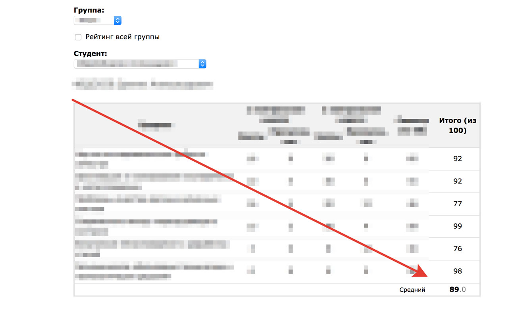

# VSTU median grade 

It's Chrome extension that calculates student's median grade at rating page

## Screenshots

## Installation

Open extension file in  [out/extension.crx](./out/extension.crx).

Turn on developer mode in Chrome, then drag it to Chrome window.