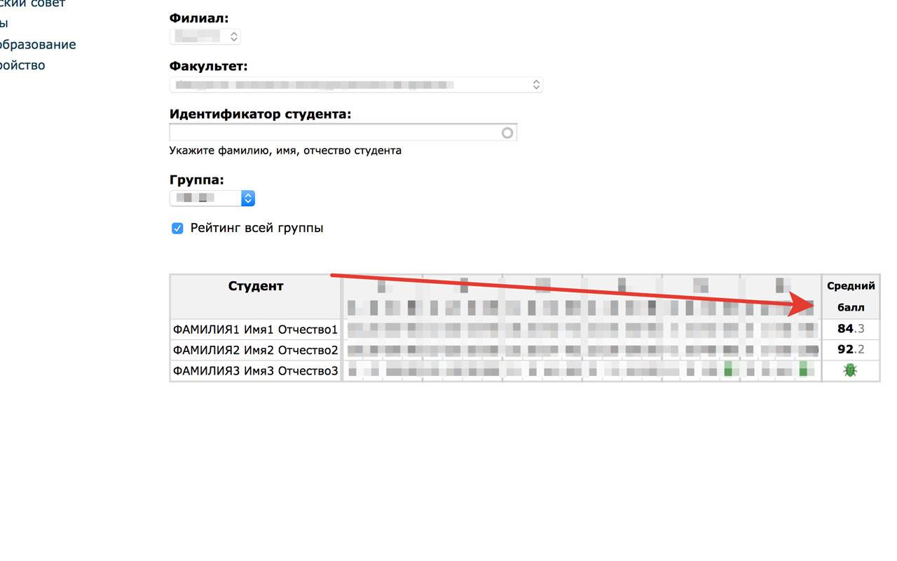

# VSTU median grade 

It's Chrome extension that calculates student's median grade at rating page

## Screenshots

## Installation

Download extension file:  [out/extension.crx](https://github.com/ColCh/vstu-median-grade/raw/master/out/extension.crx)

Turn on developer mode in Chrome, then drag it to Chrome window.